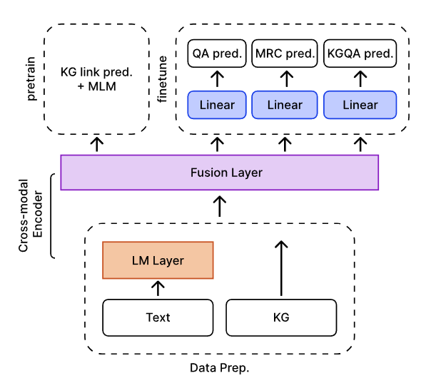

# MLSysDes - Joint Multitask Finetuning on Pretrained KG-enhanced LLM (ITMO course)

Проект направлен на разработку мультизадачной системы, которая объединяет задачи вопросов-ответов (QA), понимания текста (MRC) и работы с графами знаний (KGQA). Используется методология объединения больших языковых моделей (LLM) с графами знаний (Knowledge Graphs), что позволяет улучшить точность и производительность модели.

